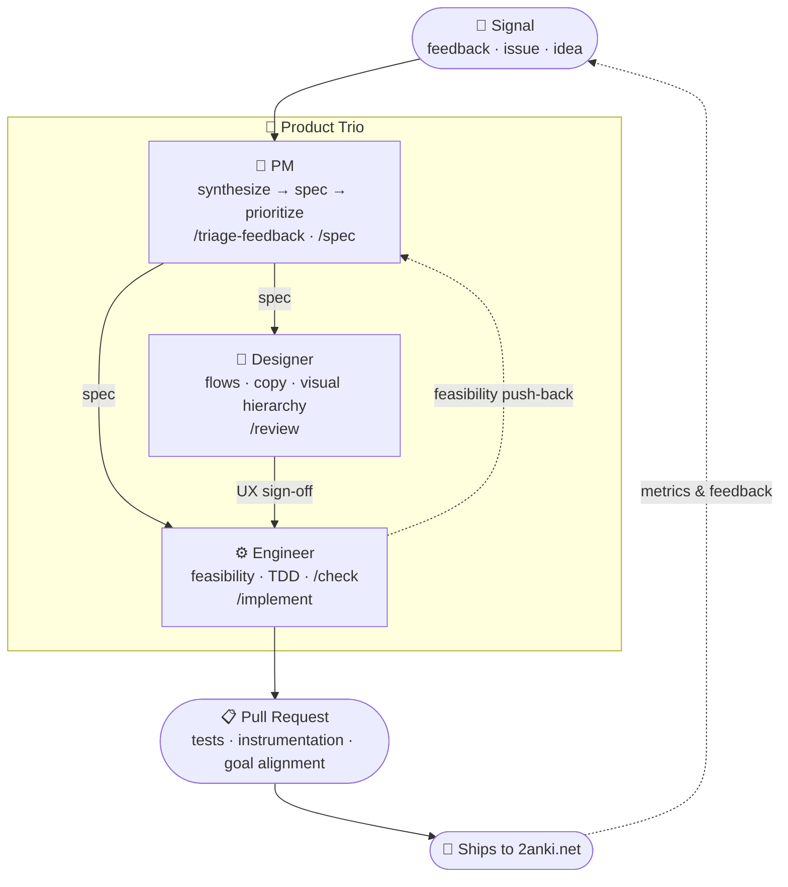

# 2anki.net

[2anki.net](https://2anki.net) helps you turn your Notion pages, HTML, Markdown, and other study material into Anki flashcards. Drop something in, get a clean `.apkg` deck back — no fuss.

## Why 2anki?

We're not replacing Anki or Notion — we're building a bridge between them. Drop in what you're studying, get a deck back.

- Free to use, no technical skills required
- Multi-format: Notion pages (via API or HTML export), Markdown, HTML, Excel (xlsx), zip bundles
- Toggle lists become cards, cloze deletions work out of the box
- Embeds, audio, images, code blocks, and LaTeX carried over
- Self-hostable if you hit the free-tier quota
- No VC funding — sustained by paying subscribers and lifetime users

## Getting started

```bash
git clone https://github.com/2anki/server.git
cd server
pnpm install
touch .env
pnpm dev
```

The server starts on `http://localhost:2020` and the frontend on `http://localhost:5173`. For server-only work: `pnpm dev:server`.

## How we develop

Every change that touches user-facing behavior goes through a **product trio**: a PM, a designer, and an engineer who consult in parallel — not in a handoff chain. The goal is to catch bad assumptions before engineering time is committed.



The trio is powered by Claude subagents in `.claude/agents/`. Use `/trio <task>` to invoke all three in parallel on any prompt.

## Contributing

We'd love your help! See [CONTRIBUTING.md](./CONTRIBUTING.md) for how to get started, run the test gate, and submit a PR.

## License

The code is licensed under the [MIT](./LICENSE) Copyright (c) 2020-2026, [Alexander Alemayhu](https://alemayhu.com). See [CREDITS.md](./CREDITS.md) for contributors.
